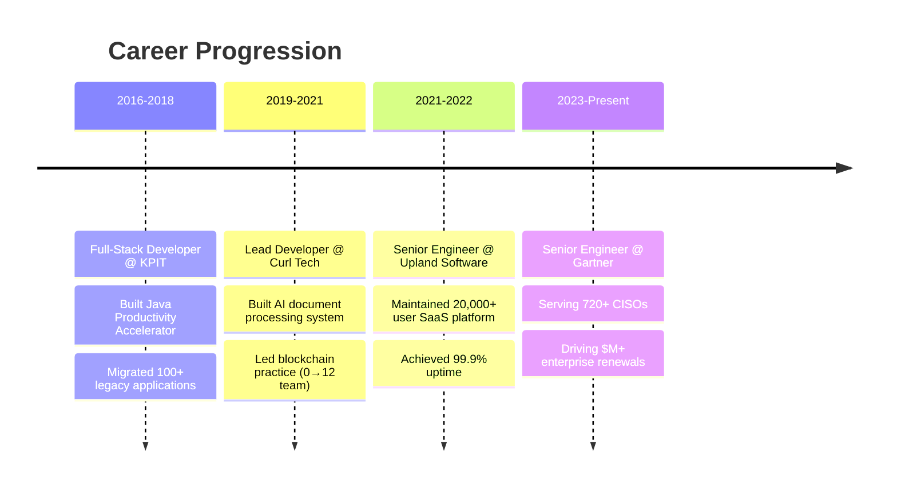

# Hi there, I'm Arunabh Priyadarshi! 👋

<div align="center">
  
</div>

## 🚀 About Me

I'm a **Senior Software Engineer** with 8+ years of experience building enterprise products that drive measurable business impact. I specialize in creating solutions that scale to serve Fortune 500 companies while leading technical teams and architectural decisions.

- 🔭 Currently working at **Gartner** building cybersecurity platforms for 720+ CISOs
- 🌱 Exploring **AI/ML integration** and **advanced microservices patterns**
- 👨‍💻 Built products serving **2,500+ users** across Fortune 500 companies
- 🏆 **3x National Finalist** in Code Gladiators (Top 300 of 250,000+ developers)
- 💬 Ask me about **Spring Boot, Microservices, Blockchain, or AI integration**
- 📫 Reach me at **arunabhmaster@gmail.com**
- ⚡ Fun fact: I once built a code generation framework that automates **75% of application development**

## 🏆 Key Achievements

<div align="center">

| 🎯 **Impact** | 📊 **Scale** | 🏅 **Recognition** |
|:---:|:---:|:---:|
| Built products driving $M+ enterprise renewals | 2,500+ users across Fortune 500 | 3x Code Gladiators Finalist |
| 75% code automation framework | 150+ legacy apps modernized | IBM Bluemix National Winner |
| Led blockchain practice 0→12 members | 1,000+ docs/day AI processing | CodeChef Global Rank 445 |

</div>

## 🛠️ Tech Stack

### Languages & Frameworks
<div align="left">
  
  
  
  
  
  
  
  
</div>

### Databases & Cloud
<div align="left">
  
  
  
  
  
  
  
</div>

### Blockchain & Emerging Tech
<div align="left">
  
  
  
  
</div>

## 📊 GitHub Stats

<div align="center">
  
  
</div>

<div align="center">
  
</div>

## 🎯 Featured Projects

### 🏢 Enterprise Solutions
- **Cybersecurity Benchmarking Platform** - Serving 720+ CISOs with AI-powered insights
- **Code Generation Framework** - Automating 75% of application development
- **Engineering Intelligence Dashboard** - Real-time visibility for 24+ projects

### 🤖 AI & Innovation  
- **Document Processing System** - 11 ML models, 99% accuracy, 1000+ docs/day
- **GenAI Test Automation** - Pioneered AI-powered testing frameworks
- **Enterprise Maven Libraries** - Serving 45+ developers across 24 applications

### ⛓️ Blockchain Solutions
- **Asset Tokenization Platform** - Real-world asset fractional ownership
- **Self-Sovereign Identity** - DIDs and Verifiable Credentials implementation
- **Hyperledger Fabric Networks** - Enterprise blockchain architectures

## 🏅 Competitive Programming

```
🏆 Code Gladiators: 3x National Finalist (2017, 2018, 2019)
   └─ Rank: Top 300 out of 250,000+ participants

🥇 IBM Bluemix Hackathon: National Winner (2015)

🏆 Alexa Hackathon: Top 25 Teams Nationally (2018)

📊 CodeChef SnackDown: Global Rank 445 (2019)
```

## 💼 Professional Journey



## 📈 Contribution Graph
<div align="center">
  
</div>

## 🎓 Speaking & Education

- 🎤 **Genesis DevCon Speaker** - International Blockchain Congress
- 📚 **4-day Blockchain Workshop** - Global Academy of Technology  
- 🎓 **B.E. Computer Science** - B.V. Bhoomaraddi College, Hubli
- 📜 **Microsoft Research Certification** - Design & Analysis of Algorithms

## 🤝 Let's Connect!

<div align="center">
  
[](https://linkedin.com/in/arunabhpriyadarshi)
[](mailto:arunabhmaster@gmail.com)
[]([https://your-portfolio-url.com](https://arunabh.me/))
[](https://medium.com/@ap2)

</div>

---

<div align="center">
  
**💡 "Building products that don't just work, but drive business results"**


⭐️ *Available for remote Tech Lead/Architect opportunities*

</div>
